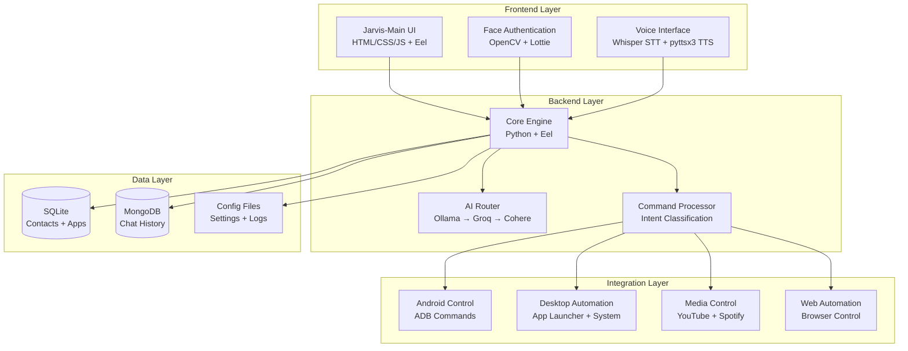

# Unified JARVIS Assistant - Design Document

## Overview

The Unified JARVIS Assistant combines the best features from three existing implementations into a single, powerful desktop application. It uses a hybrid approach with local AI (Ollama) as primary and cloud APIs as fallback, maintains the beautiful jarvis-main UI, and integrates all existing functionality including Android phone control, face authentication, and comprehensive system automation.

## Architecture

### High-Level Architecture



### Technology Stack

- **Frontend**: HTML5, CSS3, JavaScript, Bootstrap 5, Lottie Animations, SVG Graphics
- **Backend**: Python 3.8+, Eel (Python-JavaScript bridge)
- **AI/ML**: Ollama (local), Groq API (fallback), Cohere API (fallback)
- **Speech**: Whisper (STT), pyttsx3 (TTS), pvporcupine (wake word)
- **Database**: SQLite (contacts/apps), MongoDB (chat history/analytics)
- **Mobile**: ADB (Android Debug Bridge)
- **Authentication**: OpenCV (face recognition)
- **Media**: pywhatkit, webbrowser, subprocess

## Components and Interfaces

### 1. Core Application Engine

**File**: `main.py`
**Purpose**: Central orchestrator that initializes all components and manages the application lifecycle.

```python
class JarvisCore:
    def __init__(self):
        self.ai_router = AIRouter()
        self.command_processor = CommandProcessor()
        self.voice_engine = VoiceEngine()
        self.auth_manager = AuthManager()
        self.db_manager = DatabaseManager()
    
    def start(self):
        # Initialize Eel web interface
        # Start face authentication
        # Begin voice listening
        # Load user preferences
```

### 2. AI Router Component

**File**: `engine/ai_router.py`
**Purpose**: Manages multiple AI backends with intelligent fallback.

```python
class AIRouter:
    def __init__(self):
        self.ollama_client = OllamaClient()
        self.groq_client = GroqClient()
        self.cohere_client = CohereClient()
    
    async def process_query(self, query: str, query_type: str):
        # Try Ollama first (local)
        # Fallback to Groq for general queries
        # Use Cohere for decision making
        # Return structured response
```

### 3. Command Processor

**File**: `engine/command_processor.py`
**Purpose**: Classifies user intents and routes to appropriate handlers.

```python
class CommandProcessor:
    def __init__(self):
        self.intent_classifier = IntentClassifier()
        self.handlers = {
            'open_app': AppHandler(),
            'phone_call': PhoneHandler(),
            'media_play': MediaHandler(),
            'system_cmd': SystemHandler()
        }
    
    def process(self, command: str):
        intent = self.intent_classifier.classify(command)
        return self.handlers[intent].execute(command)
```

### 4. Voice Engine

**File**: `engine/voice_engine.py`
**Purpose**: Handles all speech-related functionality.

```python
class VoiceEngine:
    def __init__(self):
        self.whisper_model = whisper.load_model("base")
        self.tts_engine = pyttsx3.init()
        self.wake_word_detector = pvporcupine.create(keywords=["jarvis", "alexa"])
    
    def listen_for_wake_word(self):
        # Continuous listening for wake words
    
    def speech_to_text(self, audio_data):
        # Convert speech to text using Whisper
    
    def text_to_speech(self, text: str):
        # Convert text to speech using pyttsx3
```

### 5. Android Integration

**File**: `engine/android_controller.py`
**Purpose**: Manages all Android device interactions via ADB.

```python
class AndroidController:
    def __init__(self):
        self.adb_path = self._find_adb()
    
    def make_call(self, phone_number: str):
        # Execute ADB command to make call
    
    def send_sms(self, phone_number: str, message: str):
        # Send SMS via ADB
    
    def whatsapp_automation(self, contact: str, message: str, action: str):
        # Automate WhatsApp actions
```

### 6. Database Manager

**File**: `engine/database_manager.py`
**Purpose**: Handles all database operations for both SQLite and MongoDB.

```python
class DatabaseManager:
    def __init__(self):
        self.sqlite_conn = sqlite3.connect("jarvis.db")
        self.mongo_client = MongoClient("mongodb://localhost:27017/")
    
    def get_contact(self, name: str):
        # Search contacts in SQLite
    
    def save_chat_history(self, user_input: str, response: str):
        # Save to MongoDB
    
    def get_app_path(self, app_name: str):
        # Get application path from SQLite
```

## Data Models

### SQLite Schema

```sql
-- Contacts table
CREATE TABLE contacts (
    id INTEGER PRIMARY KEY,
    name VARCHAR(200),
    mobile_no VARCHAR(255),
    email VARCHAR(255)
);

-- System commands table
CREATE TABLE sys_command (
    id INTEGER PRIMARY KEY,
    name VARCHAR(100),
    path VARCHAR(1000)
);

-- Web commands table
CREATE TABLE web_command (
    id INTEGER PRIMARY KEY,
    name VARCHAR(100),
    url VARCHAR(1000)
);
```

### MongoDB Collections

```javascript
// Chat history collection
{
    _id: ObjectId,
    timestamp: ISODate,
    user_input: String,
    response: String,
    intent: String,
    processing_time: Number,
    ai_model_used: String
}

// User preferences collection
{
    _id: ObjectId,
    user_id: String,
    assistant_name: String,
    nickname: String,
    voice_settings: {
        rate: Number,
        pitch: Number,
        volume: Number
    },
    ui_theme: String,
    language: String
}
```

## Error Handling

### AI Service Fallback Chain

1. **Primary**: Ollama (local) - Fast, private, no API limits
2. **Secondary**: Groq API - Fast cloud inference
3. **Tertiary**: Cohere API - Reliable fallback
4. **Final**: Offline responses - Pre-defined responses for common queries

### Error Recovery Strategies

```python
class ErrorHandler:
    def handle_ai_failure(self, query: str):
        # Log error, try next AI service
        # If all fail, return helpful error message
    
    def handle_android_connection_failure(self):
        # Check ADB connection
        # Provide troubleshooting steps
    
    def handle_database_error(self):
        # Attempt database repair
        # Create backup if needed
```

## Testing Strategy

### Unit Tests
- Test each component in isolation
- Mock external dependencies (AI APIs, ADB, databases)
- Validate error handling paths

### Integration Tests
- Test component interactions
- Verify database operations
- Test AI service fallbacks

### End-to-End Tests
- Test complete user workflows
- Voice command to response cycle
- Android integration scenarios

### Performance Tests
- Response time benchmarks
- Memory usage monitoring
- Concurrent user handling

## Security Considerations

### Data Privacy
- All voice processing happens locally (Whisper)
- Chat history encrypted in MongoDB
- API keys stored securely in environment variables

### Authentication
- Optional face authentication using OpenCV
- Session management for web interface
- Secure ADB connection handling

### Network Security
- HTTPS for all external API calls
- Local network binding for web interface
- Input validation for all user commands

## Deployment Architecture

### Local Development Setup
```bash
# Install Python dependencies
pip install -r requirements.txt

# Install Ollama
curl -fsSL https://ollama.ai/install.sh | sh
ollama pull llama2:7b  # or another model under 5GB

# Setup MongoDB
# Install MongoDB Community Edition
# Start MongoDB service

# Setup Android ADB
# Enable USB debugging on Android device
# Install ADB tools
```

### Directory Structure
```
unified-jarvis/
├── main.py                 # Application entry point
├── requirements.txt        # Python dependencies
├── .env                   # Environment variables
├── engine/                # Core engine modules
│   ├── ai_router.py
│   ├── command_processor.py
│   ├── voice_engine.py
│   ├── android_controller.py
│   ├── database_manager.py
│   └── auth/
│       └── face_recognition.py
├── www/                   # Web interface (from jarvis-main)
│   ├── index.html
│   ├── style.css
│   ├── main.js
│   └── assets/
├── models/               # Local AI models
├── logs/                # Application logs
└── data/                # Database files
    ├── jarvis.db        # SQLite database
    └── backups/         # Database backups
```

## Performance Optimization

### AI Response Optimization
- Cache common responses locally
- Use streaming for long AI responses
- Implement request queuing for multiple simultaneous queries

### Database Optimization
- Index frequently queried fields
- Implement connection pooling
- Regular database maintenance tasks

### Memory Management
- Lazy loading of AI models
- Efficient audio buffer management
- Garbage collection for long-running processes

## Monitoring and Logging

### Application Metrics
- Response times for different command types
- AI service usage statistics
- Error rates and types
- User interaction patterns

### Health Checks
- AI service availability
- Database connectivity
- Android device connection status
- System resource usage

This design provides a robust, scalable, and maintainable architecture that preserves all existing functionality while adding new capabilities and improving reliability through local AI processing and intelligent fallbacks.